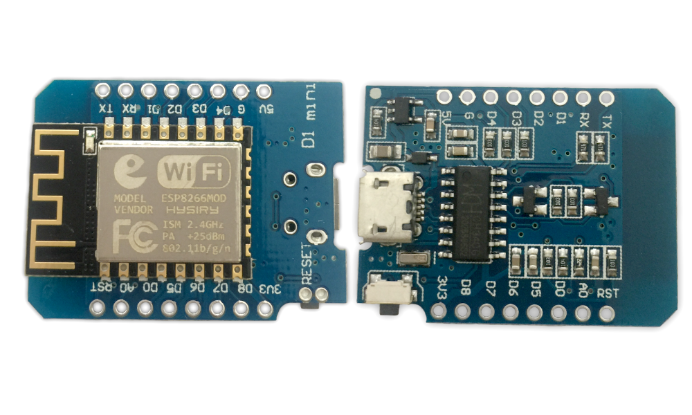
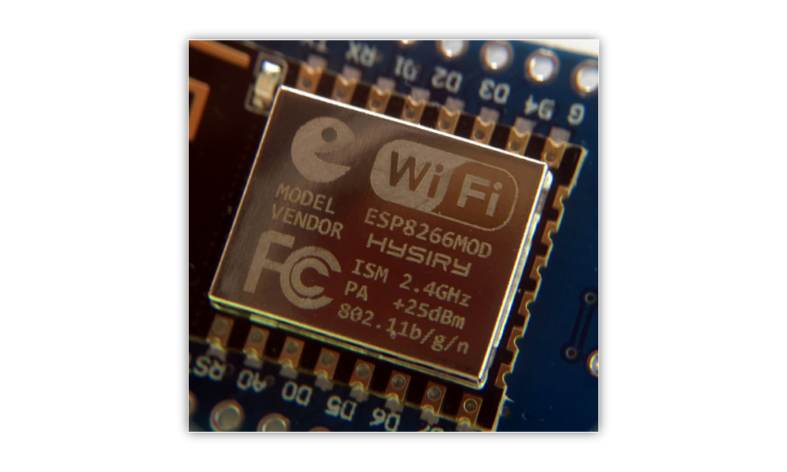
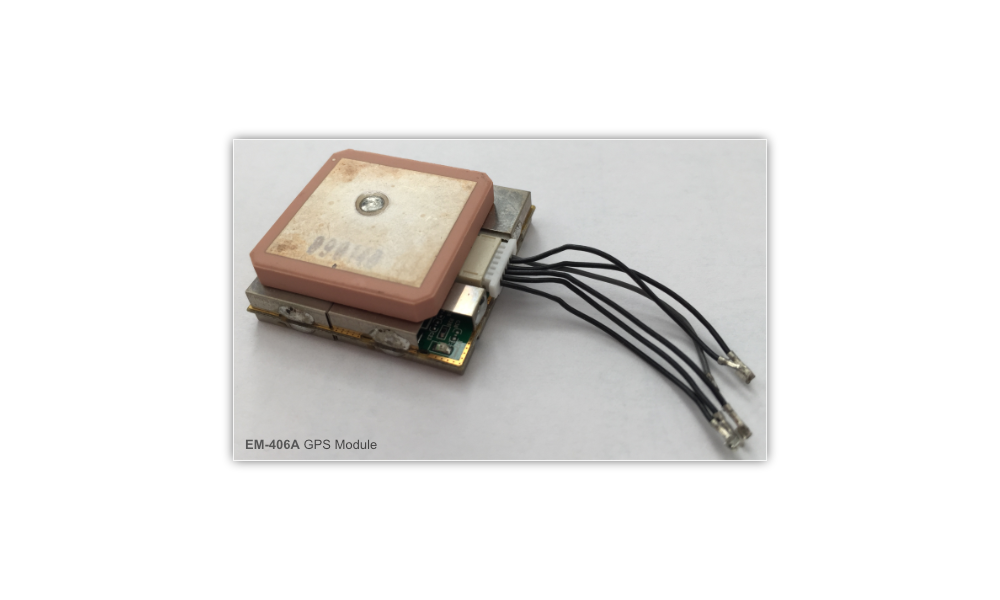

# ᵔᴥᵔ WiFi Jumper
     
> WifiJumper is a little leech, jumping from wifi network to wifi network if it's open (no encryption), when it get's the chance (internet access) it will spill it's guts back home...

So created this little project logo, thought it was fun :) But welcome! This is the WiFi Jumper project, as the small "fine print" says - It's a little device that jumps between open wifi-network and once it sees a chance to communicate it will send detailed informations back home. So you could say it's just a open-wifi network logger and that's just fine by me. I've always liked to log and collect data for later analysis so i wanted a small handy device that could do it all in one go instead of me taking along my "war driving" setup with laptop, gps, teather or 4g internet connection and so on.

It did not take long for me to settle on some ESP8266 spinoff variation that accepts avr C/C++, it has all i need. To choose the correct ESP board is actually harder than you think, there are so many spinoff's from the original Wemos D1 mini. I ordered via Amazon (DE) and just took the first and cheapest i could find. This ended up being XCSOURCE® D1 Mini (TE441-DE). It was based on a mini Nodemcu Lua WiFi that used a ESP8266-12H from Shenzhen Hysiry Technology Co., Ltd. Again it's important to know that there are a lot of the ESP8266 boards out there...

> Now lets build it, programm it and use it!
> Please note that the database backend part is not covered to a full extend here. It's up to you what you want to do with the data!

## Table of contents

 * [WiFi Jumper](#wifi-jumper)
 * [Project photos](#project-photos)
 * [Apache / Database backend (data logging)](#apache--database-backend-data-logging)
 * [Donations](#donations)
 * [References](#references)
 * [Reporting Bugs](#reporting-bugs)
 * [Subscribe](#subscribe)

## WiFi Jumper

> So to boil it all down, I want something to connect to a open wifi network.
> If it has internet access, send detailed information back home
> - That's it :)

I want it to scan the area for wifi-networks, if it finds a open network (ie. no encryption) i want it to connect to that network. Check if it can send a request to my backend with details on the connected network and location. If it's succssful then disconnect continue scanning for open networks and it all starts over.

Of course we need error checking and also we need a way to keep track inside the unit what networks it has been connected to so it won't try to re-connect to any previous networks.

Below you will find my "TODO" list, this is more or less just my thoughts on what it should be able to do and what could be cool to do.

*My TODO list*

- [ ] Function to scan for networks
- [ ] Function to scan for networks with no encryption
- [ ] Perhaps combind above functions?
- [ ] Have a hardcoded BSSID blacklist?
- [ ] Function to get GEO location
- [ ] Function(s) to toggle low power mode?
- [ ] Function to disconnect from wifi network
- [ ] Case LED's to show status?
- [ ] Function to POST/GET details
- [ ] Storing Persistent Data in ESP8266
- [ ] Look into ESP8266FS
- [ ] Look into File system object (SPIFFS)
- [ ] Function to add "used" BSSID's
- [ ] Function to remove "used" BSSID's

## Project Photos

I thought it would be fun with a bit more project photos. GitHub has always been a cool source for projects and knowlagde but sometimes i think it lacks better "README" files (i know documentation is boring..). Many projects don't really tell the hole story or show what is what. Many times you are left behind to just guess what the creater/maker was thinking etc. So i wanted to include a bit of project photos for your viewing pleasure :)

> **XSOURCE D1 Mini**
>
> This is the XSOURCE D1 Mini board, based on ESP8266 microcontroller

> **ESP8266-12H**
>
> This is the ESP8266 microcontroller from Shenzhen Hysiry Technology Co., Ltd

> **EM-406A GPS Module**
>
> Sirf III chipset GPS module with 6 pin cable. Includes power/lock indicator LED and backup supercap

## Apache / Database backend (data logging)

The backend is jsut a simple Apache web server hosting a PHP file that accepts my WiFi Jumper requests. It takes the arguments and save them to a database (MySQL in my case) where it logs the timestamp of the request to (to get around not having a Real-Time clock located on the device).

I'll perhaps later on get into details on how my PHP script is made up but as you would have guessed, it's just inserting all the data from the request into the database for later viewing pleasure :)

## Donations

Code maintaining is hard! I need beer on a regular basis :)
This is of course fully optional, i just think it's nice to give the option.

You can donate Bitcoins or Ethereum to me for maintaining the project.

> Bitcoin address - 31jzgaJZuzGhDZQYrDTHQzmRFYnvHhzr57

> Ethereum address - 0x39BA5839830E9207FF3aC1c21d08d636548009D4

## References

When I find something online that I think I can use, implement or otherwise lean from when building my project I will show it here. There is of course a couple of major references/sources that keeps popping up again and again. These are listed below to.

> Data Sheets
 * [ESP8266-12H DataSheet](Docs/ESP8266-12H-DataSheet.pdf)
 * [MAX4465-MAX4469 DataSheet](Docs/MAX4465-MAX4469.pdf)
 * [MAX9814 DataSheet](Docs/MAX9814.pdf)

> Web sites
 * [Shenzhen Hysiry Technology Co., Ltd](http://en.hysiry.com)
 * [Maxim Integrated](https://www.maximintegrated.com/)
 * [FCC ID 2AKBPESP826612H](https://fccid.io/2AKBPESP826612H)
 * [MAX4465–MAX4469](https://www.maximintegrated.com/en/products/analog/audio/MAX4466.html)

## Reporting Bugs

Report all issues in the [issues tracker](https://github.com/kawaiipantsu/wifijumper/issues).

## Subscribe

Stay tuned to new releases with the project [feeds](https://github.com/kawaiipantsu/wifijumper/releases.atom).
